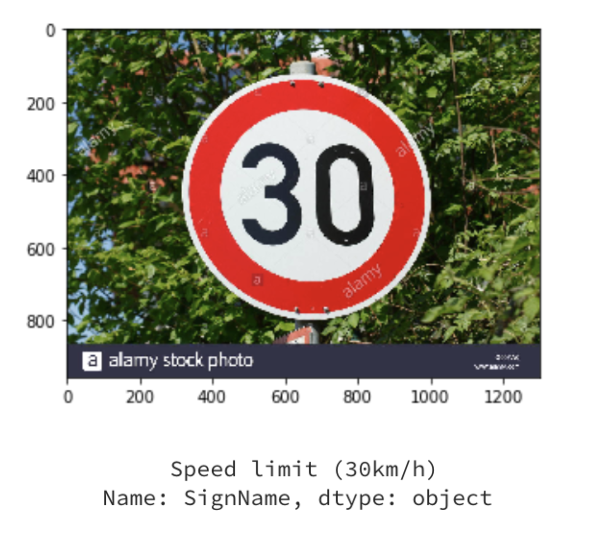
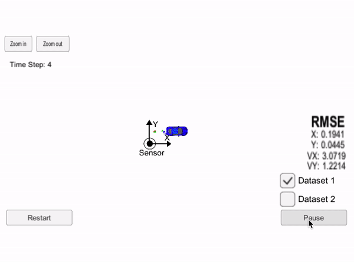
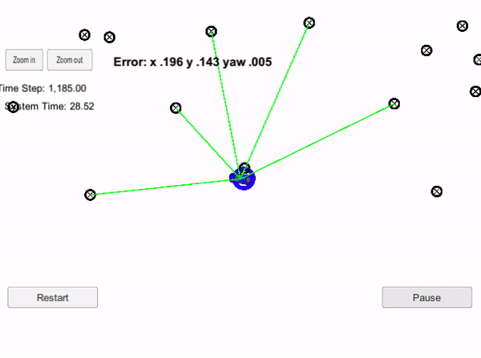

# Self Driving Car Projects

A number of autonomous vehicle projects I coded along with the [Udacity Self Driving Car Nanodegree program](https://www.udacity.com/course/self-driving-car-engineer-nanodegree--nd013 "Udacity Self Driving Car"). Main topics include computer vision, behavior cloning, deep learning, sensor, localization, and path planning. With some prior knowledge in computer vision and robotics, I came into the nanodegree for the exciting projects it offers and I certainly gained experience in implementing my code for solving this real world problem. 

# Show before Tell

<table style="width:100%" align="center" valign="center">
  <tr>
    <th width="33.3%">
      

           
            Finding Lane Lines
            <a href="./1_Finding_Lane_Lines">Code</a>
      

    </th>
    <th>
      

         
          Advanced Lane Finding
          <a href="./2_Advanced_Lane_Finding">Code</a>
      

    </th>
    <th width="33.3%">
        

         
          SSD Object Detection
          <a href="./4_SSD_Object_Detection">Code</a>
      

    </th>
  </tr>
  <tr>
    </th width="33.3%">
    <th>

           
            Traffic Sign Classifier
            <a href="./3_Traffic_Sign_Classifier">Code</a>
        

    </th>
    <th width="33.3%">
      

           
            Behavioral Cloning
            <a href="./5_Behavioral_Cloning">Code</a>
        

    </th>
    <th width="33.3%">
          

           
            Extended Kalman Filter
            <a href="./6_Extended_Kalman_Filter">Code</a>
        

    </th>
  </tr>
  <tr>
    <th width="33.3%">
      

           
            Particle Filter
            <a href="./7_Particle_Filter">Code</a>
        

    </th>
    <th width="33.3%">
      

           
            PID Controller
            <a href="./8_PID_Controller">Code</a>
        

    </th>
    <th width="33.3%">
          

           
            Path Planning
            <a href="./9_Path_Planning">Code</a>
        

    </th>
  </tr>
</table>

# Table of Contents

#### [1 - Finding Lane Lines](1_Finding_Lane_Lines)
 - Built a simplistic lane detection pipeline with **color selection**, **region masking**, **Canny edge detection** and **Hough transforms**.
 - Computer Vision

#### [2 - Advanced Lane Finding](2_Advanced_Lane_Finding)
 - Built an advanced lane-finding algorithm using **distortion correction**, **image rectification**, **color transforms**, **view warping**, **sliding window**, **gradient thresholding**, and **curvature measure**. Colored the detected curved lane area in green. Calculated lane curvature and vehicle displacement. Overcame environmental challenges such as shadows and pavement changes.
 - Computer Vision, OpenCV
 
#### [3 - Traffic Sign Classification](3_Traffic_Sign_Classifier)
 - Built, trained, and tuned a **convolutional neural network** to classify traffic signs. Tried out a different neural network architectures. Performed **image augmentation** to combat overfitting.
 - Python, Deep Learning, TensorFlow, Keras, Computer Vision
 
#### [4 - SSD Object Detection](4_SSD_Object_Detection)
 - Learned (**separatable depthwise convolutions**), trained, and tuned **MobileNets**. Employed **Single Shot Detection** for **real-time** object detection. 
 - Python, Keras, Convolutional Neural Networks, MobileNets, Separable Depthwise Convolutions 
 
#### [5 - Behavioral Cloning](5_Behavioral_Cloning)
 - Built, trained. and tuned a **deep convolutional neural network** for **end-to-end driving** in Udacity simulator with limited data. Used techniques such as self created image augmentation generator with the **ImgAug library** and dropout layers to combat overfitting. 
 - Python, Deep Learning, Keras, Convolutional Neural Networks, NVIDIA CNN, ImgAug

#### [6 - Extended Kalman Filter](6_Extended_Kalman_Filter)
 - Implement the **extended Kalman filter** in C++. Simulated noisy lidar and noisy radar measurements were used to estimate the vehicle position and velocity. **Kalman filter** was used to perform **sensor fusion** on the lidar measurements and radar measurements to track the vehicle's position and velocity.
 - C++, Kalman Filter, Extended Kalman Filter
 
#### [7 - Particle Filter](7_Particle_Filter)
 - Used **noisy** GPS, sensor, control data and a landmark map to precisely track a run away vehicle. A **2D particle filter** was implemented in C++. 
 - C++, Particle Filter

#### [8 - PID Controller](8_PID_Controller)
 - Implemented a **proportional-integral-differential controller** for keeping the car on track by appropriately adjusting the steering angle. Tuned the coefficient of each component of the mechanism for the car to drive safely.
 - C++, PID Controller

#### [9 - Path Planning](9_Path_Planning)
 - Built a **path planner** that is able to create **smooth, safe trajectories** for the car to follow. The simulated car is able to **navigate on a highway** with many other cars going at 40-50 mph. 
 - C++, Path Planning

# Disclaimer

The git commit history time is quite inaccurate as some projects were already done before this repo existed.

Most media files (videos and images) were provided by Udacity. 

The driving simulators were developed by Udacity.

